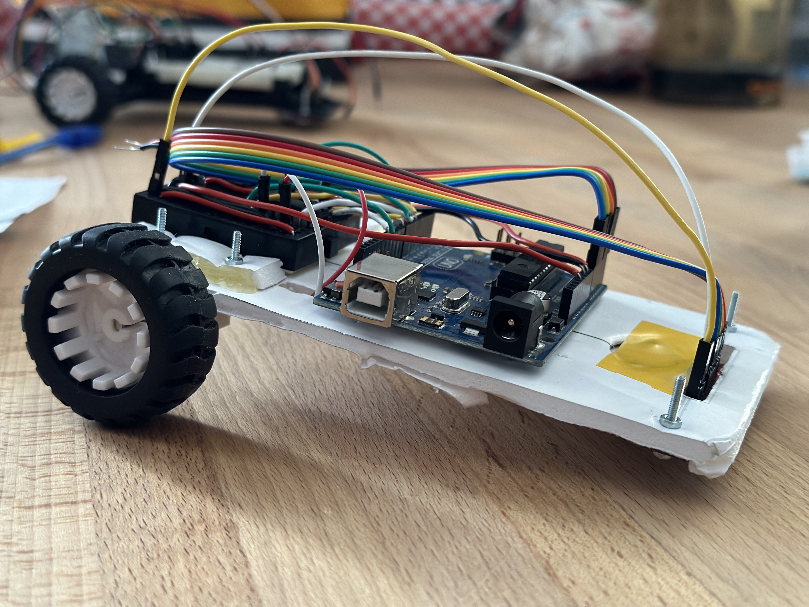
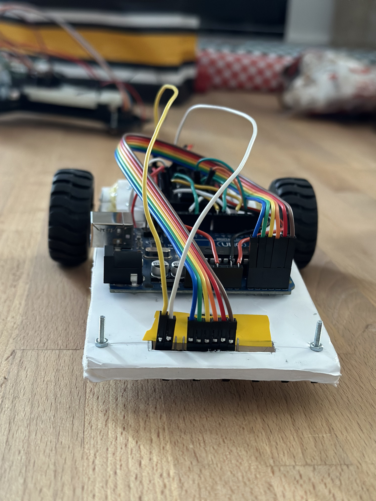
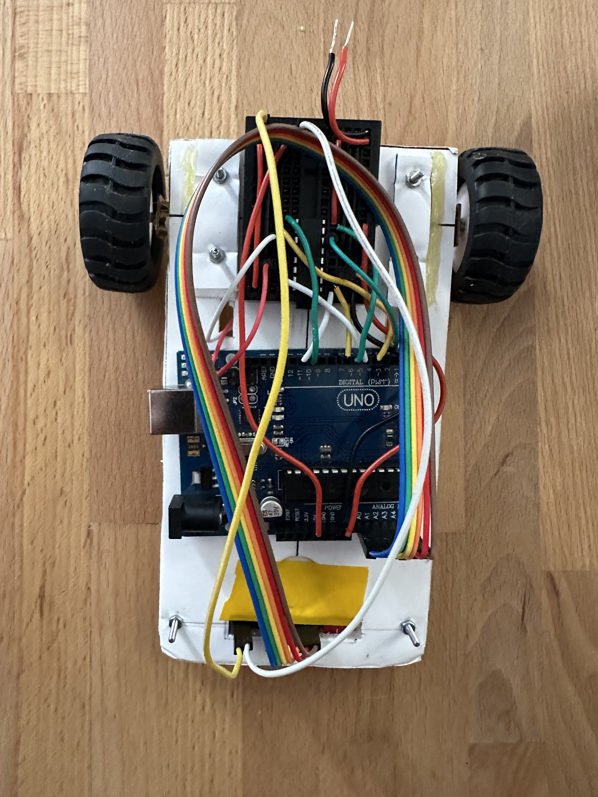

# Turbo Fabi - Line Follower

## Project Overview 🤖

Welcome to Turbo Fabi, a line follower project that utilizes PID control. Turbo Fabi is a robot designed to autonomously track and follow a predefined path marked by a visible line on the ground. This project is implemented using the Arduino Uno and motor drivers, with infrared (IR) sensors for line detection.

## Table of Contents 📋

- [Project Overview](#project-overview)
- [Dependencies](#dependencies)
- [Hardware Requirements](#hardware-requirements)
- [Usage](#usage)
- [Contributing](#contributing)
- [Media](#media)
- [Best Time Achievement](#best-time-achievement)

## Dependencies 🛠️

- **Arduino IDE**: The project is developed using the Arduino platform, specifically the Arduino Uno.
- **Motor Drivers**: The project assumes the use of motor drivers compatible with the Arduino Uno and chosen motors.
- **Infrared (IR) Sensors**: Line following is typically implemented using IR sensors. Ensure you have the required number of sensors.

## Hardware Requirements 🚀

1. **Chassis**: A suitable robot chassis with two or more wheels.
2. **Motors**: DC motors compatible with the Arduino Uno and chosen motor drivers.
3. **Wheels**: Wheels suitable for the chosen chassis and motors.
4. **IR Sensors**: Infrared sensors for detecting the line on the ground.
5. **Battery**: A power source suitable for your motors and electronic components.

## Usage 🎮

1. Set up Turbo Fabi on a track with a visible line.
2. Power on Turbo Fabi.
3. Watch as Turbo Fabi autonomously follows the line.

## Contributing 🤝

Contributions from the following individuals have made Turbo Fabi possible:

- [0xfabian](https://github.com/0xfabian)
- [alexalex200](https://github.com/alexalex200)
- [dragos1113](https://github.com/dragos1113)

## Media 📸

### Videos

- [You can watch the full video here!](https://youtu.be/HdzTXu5iEFA)

### Pictures

## Best Time Achievement 🏆

Turbo Fabi completed the circuit with an impressive best time of **13.551 seconds**.
